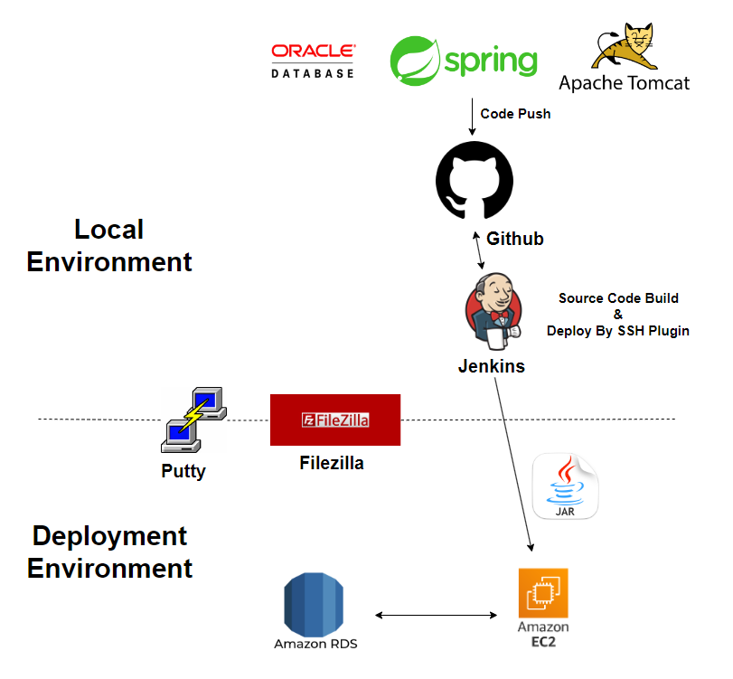
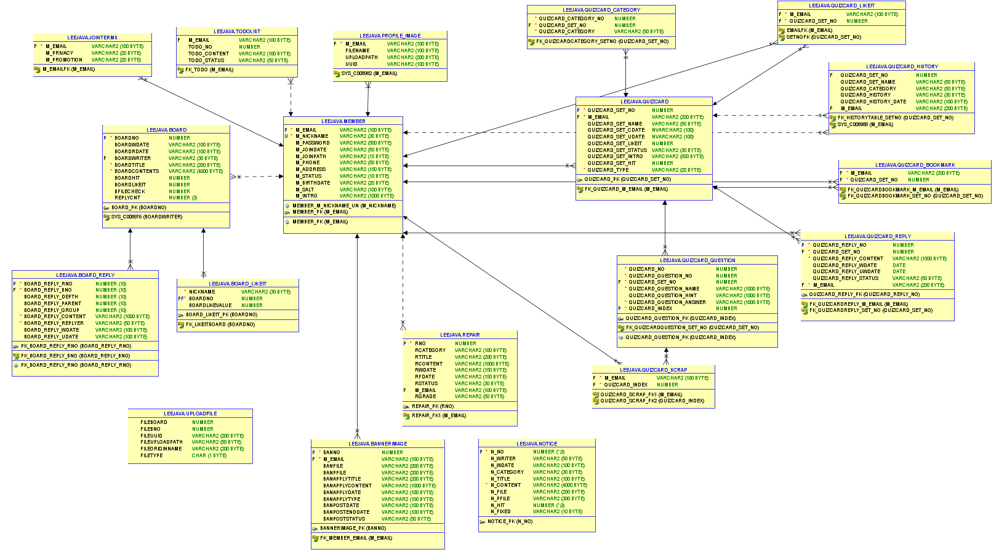

# Coder Ground

## ✔️ 한 줄 소개
- 개발자들 간의 소통 공간과 **카드 학습(Quiz Card)**, **투두리스트** 등 학습/생산성 유틸리티를 제공하는 커뮤니티 웹 애플리케이션

---

## ✔️ 프로젝트 소개
정보처리기사 및 프로그래밍 지식을 복습하는 과정에서 **Quizlet**의 카드 학습 방식에서 아이디어를 얻었습니다.  
문제/답을 카드 형태로 만들고, 문제 영역에 간단한 프로그래밍 문법/코딩 문제를 입력해 **자기주도 학습을 돕는 웹서비스**를 목표로 기획했습니다.

또한 국비지원 수료 후 최종 프로젝트를 진행하며 기초 개념의 부족함을 느꼈고,  
**정보처리기사 실기 준비 + 개인 프로젝트**를 병행하며 부족한 부분을 복습하기 위한 목적으로 개발했습니다.

---

## 📎 GitHub
- **Repository**: https://github.com/2badasea/coder_ground

---

## ✔️ 사용 언어 & 라이브러리 / 도구
- **개발 언어**: Java, HTML/CSS, JavaScript
- **프레임워크 & 라이브러리**: Spring, jQuery
- **데이터베이스**: Oracle Database 11g
- **서버**: Tomcat 9.0
- **IDE**: Eclipse, SQL Developer
- **빌드/배포**: Maven, Jenkins, AWS EC2, AWS RDS(Oracle)
- **형상관리**: GitHub

---

## ✔️ 빌드 & 배포 Architecture

### 배포 흐름 요약
- GitHub에 **push** → Jenkins가 **빌드**
- Jenkins의 **Publish Over SSH** 플러그인으로 EC2(Tomcat)에 **배포**
- EC2(Ubuntu) 환경에서 **AWS RDS(Oracle)** 와 연동
- 서버 환경 구성/파일 전송을 위해 **PuTTY**(CLI 접속), **FileZilla**(FTP) 사용

### 배포 주소
- http://3.36.153.209:8080/coderground/
  - 현재는 내려간 상태입니다.  
    (AWS RDS의 Oracle은 프리티어가 없어 비용 부담으로 중단)

---

## ✔️ DB 구성도 (2023.05.17 ver)

### 설계 요약
- 핵심 엔티티는 **Member(사용자)**, **Quizcard(퀴즈 카드)** 중심으로 구성
- 마이페이지 등 일부 조회는 보안/성능 고려하여 **View**로 분리하여 사용
- 기본키는 **Sequence** 기반으로 관리
- 일부 테이블은 복합 식별이 필요해 인조키 형태로 구성  
  - 예: `QUIZCARD_QUESTION`의 게시글 번호 + 게시글 내 문제 번호를 조합해 식별 컬럼을 구성(예: `QUIZCARD_INDEX`)

---
